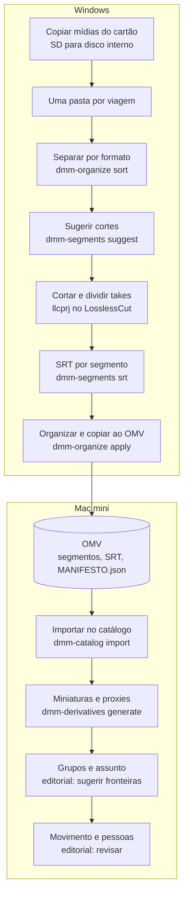

# Fluxo completo: do cartão SD ao editorial

Sequência de trabalho de uma viagem, do Windows ao Mac. Cada etapa aponta o
comando e o runbook detalhado. Todos os comandos `dmm-*` simulam por padrão e
só gravam com `--apply` (exceto `dmm-organize apply`); nenhum deles altera o
cartão SD ou sobrescreve arquivos existentes.



Os exemplos usam a viagem `D:\Drone_Temp\Caconde`. Execute os comandos `uv`
a partir de `C:\dev-apps\drone-orgnize`, depois de `. .\scripts\dev-env.ps1`.

## Windows

### 1. Copiar as mídias do cartão

Copie os arquivos do cartão (MP4, SRT, JPG) para uma pasta da viagem no disco
interno, por exemplo `D:\Drone_Temp\Caconde`. Não trabalhe direto no cartão.
O assunto (Cristo, Barragem...) **não** precisa de pasta: ele é definido no
editorial, a partir do GPS e das miniaturas.

### 2. Separar por formato

Move os originais para `YOUTUBE_16x9`, `INSTAGRAM_9x16`, `FOTOS` e
`OUTROS_REVISAR`, com a mesma regra do organizador (proporção de exibição via
ffprobe, considerando a rotação). O SRT de cada vídeo vai junto. Assim é
possível editar Instagram antes de YouTube.

```powershell
uv run dmm-organize sort --source "D:\Drone_Temp\Caconde"          # simula
uv run dmm-organize sort --source "D:\Drone_Temp\Caconde" --apply  # move
```

Só arquivos no nível da pasta são movidos; subpastas já separadas ficam como
estão. Um destino existente gera `CONFLICT` e o arquivo não é movido. Rode este
passo **antes** de cortar: depois dos cortes, o projeto do LosslessCut fica em
`Editados` ao lado do original e mover o original o separaria do projeto.

### 3. Sugerir os cortes do início e do fim

Para cada pasta de formato, gera `<original>-proj.llc` em `Editados` com o
trecho parado do início e do fim já desmarcado. Detalhes em
[segments.md](segments.md).

```powershell
uv run dmm-segments suggest "D:\Drone_Temp\Caconde\INSTAGRAM_9x16" --output "D:\Drone_Temp\Caconde\INSTAGRAM_9x16\Editados" --apply
```

Crie a pasta `Editados` antes, se ainda não existir.

### 4. Cortar e dividir os takes

Abra cada original com a função `llcprj` do perfil do PowerShell; ela aponta a
saída do LosslessCut para `Editados` e o projeto sugerido é carregado.

```powershell
llcprj "D:\Drone_Temp\Caconde\INSTAGRAM_9x16\DJI_20260605142803_0245_D.MP4"
```

Ajuste os pontos, divida em quantos segmentos quiser e exporte. **Exporte
também a trilha de dados** (`-stream-1-data-djmd.bin`): sem ela, sem o SRT e
sem o original, a posição dos segmentos não pode ser recuperada.

### 5. Gerar o SRT de cada segmento

Cria um `.SRT` por segmento com o GPS, a altitude e o gimbal do seu trecho do
original, alinhado ao keyframe real do corte.

```powershell
uv run dmm-segments srt "D:\Drone_Temp\Caconde\INSTAGRAM_9x16\Editados" --apply
```

### 6. Organizar e copiar ao OMV

Copia os segmentos e seus SRTs para o OMV com verificação SHA-256 e publica o
`MANIFESTO.json` da viagem. Use a pasta `Editados` como origem (não a pasta da
viagem, que também contém os originais). Sem `--poi`, os nomes ficam neutros;
o assunto é definido no editorial.

```powershell
uv run dmm-organize plan  --source "D:\Drone_Temp\Caconde\INSTAGRAM_9x16\Editados" --trip "Caconde" --output-omv "S:\Drone-Originais"
uv run dmm-organize apply --source "D:\Drone_Temp\Caconde\INSTAGRAM_9x16\Editados" --trip "Caconde" --output-omv "S:\Drone-Originais"
```

Repita para cada formato com exatamente o mesmo `--trip`; o manifesto da
viagem acumula os assets (um nome de viagem diferente para o mesmo slug é
recusado). `.llc` e
`.bin` aparecem como não suportados e não são copiados. Como `plan` e `apply`
leem cada arquivo inteiro, rode-os com o OMV na rede local, não via Tailscale.

## Mac mini

### 7. Importar no catálogo

```bash
uv run dmm-catalog import "$DMM_OMV_ROOT/caconde/MANIFESTO.json"
```

Ver [mac-server.md](mac-server.md#phase-2a-import-the-phase-1-editorial-manifest).

### 8. Gerar miniaturas e proxies

```bash
uv run dmm-derivatives generate --trip caconde
```

Ver [derivatives.md](derivatives.md).

### 9. Grupos e assunto no editorial

Abra `https://<nome-do-mac>:8000/editorial/`, escolha a viagem e use **Sugerir
fronteiras**. O agrupamento usa o GPS dos SRTs (inclusive dos segmentos),
horário e sequência. Nomeie cada grupo com o assunto, com sugestões do Google
Places quando configurado. Ver [grouping.md](grouping.md) e
[location-names.md](location-names.md).

### 10. Movimento e pessoas

Revise no editorial o movimento sugerido pela telemetria de cada segmento e
marque pessoas/assunto.

## Limites conhecidos

- O catálogo não registra que vários segmentos vieram do mesmo original; eles
  ficam próximos pela ordem e pelo grupo.
- A leitura do GPS embutido no MP4 foi validada no DJI Flip.
- A sugestão de cortes não divide os takes internos; isso continua manual.
